import Link from '@docusaurus/Link'
import Image from '@theme/IdealImage'
import thumbnail from '/img/mini-keeb.avif'

# I, Noisebot
Or: How I made playing records through my home Sonos set up nice with some DIY dedicated hardware. You can find the project code [on my github](https://github.com/ambirdsall/noisebot).

:::note
This write-up was started a few months after finishing the project, and so there is a chance I have misremembered some detail, some side learning, some bit of context. Do leave a comment if you catch a mistake!
:::

## The Problem
I bought a couple of Sonos speakers some years back. It has been great for streaming digital audio, but some of the shine wore off when I added my phonograph to the system[^1]. I was using a setup something like this:

[^1]: Part of this was just collateral damage from a classically graceless corporate upgrade: Sonos dropped support for the `Connect:Amp` device (the one with a line in for the phonograph) more or less while I was unwrapping it, and immediately commenced a nagging campaign to get us to upgrade to a shiny and incompatible v2 of their smartphone app.

```mermaid
graph TB
    A["Bedroom<br>🔊"]
    B["Kitchen<br>🔊"]
    C["Living Room<br>🔊"]
    D["TV Room<br>🔊"]
    
    %% Vertical alignment for analog components
    subgraph AnalogSource[" "]
        direction TB
        Phono["Record Player<br>🎵 "]
        E["Line In<br>🎵🔗🔈"]
        Phono --> E
    end

    class A,B,C,D speakerNode;

    %% Dotted grey bidirectional connections
    B <-.-> C
    B <-.-> D
    E <-.-> B
    E <-.-> C
    E <-.-> D
    A <-.-> B
    A <-.-> C
    A <-.-> D
    E <-.-> A

    classDef speakerNode fill:#d1e8ff,stroke:#1e90ff,stroke-width:2px,color:#000;
    linkStyle default stroke:#999,stroke-dasharray: 4 4;
    linkStyle 0 stroke:#333,stroke-width:2px,stroke-dasharray: 0;
```

I didn't have speakers wired to the Line In box, which meant actually playing a record required the following steps:
- take out my smartphone and open the sonos app
- go to the "rooms" tab
- select the "Line In" device
- hit the "Group" button and connect another speaker—"Living Room", say
- go to the "browse" tab
- select the "Line in" input (provided by the Line In "room", i.e. device)
- put the record on the phonograph
- start the phonograph spinning
- put the needle down

Changing the volume was another whole round of taps:
- take out phone, open sonos app
- back to the "rooms" tab
- select the line in group
- pull up selected group's playback controls to get volume

It was all perfectly _doable_—and credit where due, the volume slider interface is very nice when you get there—but tapping through all those screens added friction, made it feel like a chore, and we didn't listen to records at all for a long time. There had to be a better way. 

## A Better Way
Here's the process I wanted:
- put the record on the phonograph
- start the phonograph spinning
- press some easy to reach button next to the phonograph that does all the work to connect speaker(s) and route audio
- put the needle down

And for changing the volume:
- twiddle a volume knob

I had a UI in mind, even: as a programmer, I do enough typing to have researched keyboard enthusiast spaces online, and there I had seen several examples of macro pads[^4] equipped with a handful of remappable keys and a rotary knob. Here's the layout I ended up going with, but I could have gone smaller: the whole top row was optional.

<svg
  viewBox="0 0 260 120"
  width="100%"
  height="auto"
  xmlns="http://www.w3.org/2000/svg"
  style={{ maxWidth: '300px', margin: '2rem auto', display: 'block' }}
>
  {/* Keys - Top Row */}
  <rect x="10" y="10" width="50" height="40" rx="8" fill="#eee" stroke="#333" />
  <text x="35" y="35" fontSize="16" textAnchor="middle" fill="#333">b</text>

  <rect x="70" y="10" width="50" height="40" rx="8" fill="#eee" stroke="#333" />
  <text x="95" y="35" fontSize="16" textAnchor="middle" fill="#333">p</text>

  <rect x="130" y="10" width="50" height="40" rx="8" fill="#eee" stroke="#333" />
  <text x="155" y="35" fontSize="16" textAnchor="middle" fill="#333">f</text>

  {/* Keys - Bottom Row */}
  <rect x="10" y="70" width="50" height="40" rx="8" fill="#eee" stroke="#333" />
  <text x="35" y="95" fontSize="16" textAnchor="middle" fill="#333">l</text>

  <rect x="70" y="70" width="50" height="40" rx="8" fill="#eee" stroke="#333" />
  <text x="95" y="95" fontSize="16" textAnchor="middle" fill="#333">t</text>

  <rect x="130" y="70" width="50" height="40" rx="8" fill="#eee" stroke="#333" />
  <text x="155" y="95" fontSize="16" textAnchor="middle" fill="#333">k</text>

  {/* Rotary Knob */}
  <circle cx="220" cy="60" r="35" fill="#ccc" stroke="#333" strokeWidth="2" />
  <text x="220" y="48" fontSize="14" textAnchor="middle" fill="#000">↻ u</text>
  <text x="220" y="65" fontSize="14" textAnchor="middle" fill="#000">↺ d</text>
  <text x="220" y="81" fontSize="12" textAnchor="middle" fill="#222">(m)</text>
</svg>

- top row: playback controls
  - left: `b`ackwards track
  - middle: ensure `p`honograph is audio source
  - right: `f`orwards track
- bottom: device toggles
  - `l`iving room speaker
  - `t`v soundbar
  - `k`itchen speaker
- knob: 
  - clockwise: `u`p volume
  - counterclockwise: `d`own volume
  - press: toggle `m`ute

## The breakthrough: finding a library to control the speakers
I knew Sonos speakers coordinate with network requests over wifi[^2]; if I had a programatic way to send the same kind of network requests, I could use trigger it with that macro pad and automate away all the bother with telephones. If you press the "living room" button, the speaker there either starts or stops playing the record; turn the volume knob, the volume changes. Creating a wrapper library was likely a matter of observing and reverse-engineering some private HTTP api, and people do that every day. To a search engine!

[^2]: Presumably with audio streamed over UDP and ordinary http requests for commands and events

There were indeed some open-source libraries for interacting with sonos, and they were all on npm; I've written a lot of javascript in my career, so a node script was old hat. _Marvelous._ I did some quick experiments; the one that made it easiest to find my speakers and order them around goes by `sonos` on npm and `node-sonos` [on github](https://github.com/bencevans/node-sonos).

For hardware, I had an unused Raspberry Pi Zero[^3] around: that gave me a computer which was tiny enough to stash in a small device, while still having a wifi antenna to communicate with the speakers and enough CPU to run a node script in an ordinary linux terminal. The programming model looked straightforward, too: the macropad was just a funny USB keyboard, so I could directly connect it to the pi while running the script, which just has to listen for characters coming in on `stdin` and get ready to trigger callbacks when it reads the right ones. My plan was coming together nicely:

[^3]: specifically, a [Raspberry Pi Zero W](https://www.raspberrypi.com/products/raspberry-pi-zero-w/) v1.1
[^4]: "Macro pads" are small mechanical keyboards with just a handful of keys, each of which is then programmed to send some useful, but hard to type, keyboard shortcut

```mermaid
graph TD
    subgraph "Hey let's hear a record"
        Keyboard["Macro Pad<br>(⌨ + 🎛)"]
        Pi["Raspberry Pi Zero W<br>🤖 running a <code>node-sonos</code>-based node.js script"]
        Keyboard --> Pi
    end

    subgraph "Sonos System"
        Speakers["Living Room et al<br>🔊🔊🔊"]
        ConnectAmp["Line In<br>🎵🔗🔈"]
        Phono["Record Player<br>🎵 "]

        Phono --> ConnectAmp
        Speakers <-.-> ConnectAmp
    end

    Pi -.-> Speakers
    Pi -.-> ConnectAmp

    %% Style only the dotted arrows (links 5 and 6)
    linkStyle 2 stroke:#888,stroke-dasharray: 5;
    linkStyle 3 stroke:#888,stroke-dasharray: 5;
    linkStyle 4 stroke:#888,stroke-dasharray: 5;
```

This looked close to ideal, and the only thing I didn't already own was a little macro pad; so I went ahead and ordered [the cheapest one I could find on aliexpress](https://www.aliexpress.us/item/3256807827316893.html):

<Image img={thumbnail} />

With my hardware assembled, I still had to complete three tasks, which could all be—at least partially—developed in isolation:
- <Link to="./scripting"><strong>write a headless but interactive sonos TUI as a node.js script:</strong></Link> I could write and run the code on a normal laptop if the Raspberry Pi weren't ready, using the laptop keyboard to trigger actions if the mini one weren't ready
- <Link to="./mini-keyboard"><strong>set up a raspberry pi zero to run that script</strong></Link>, using a laptop keyboard over `ssh` to test the script if the mini keyboard weren't ready
- find out <Link to="./raspberry-pi-zero"><strong>what codes my mini keyboard sends</strong></Link> for each key and the knob, remapping them as needed; this has no dependency on the Raspberry Pi at all.

Each problem has a dedicated page with a more detailed explanation. Let's dig in!
