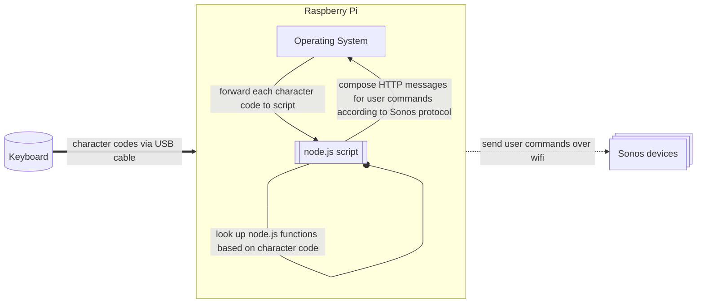
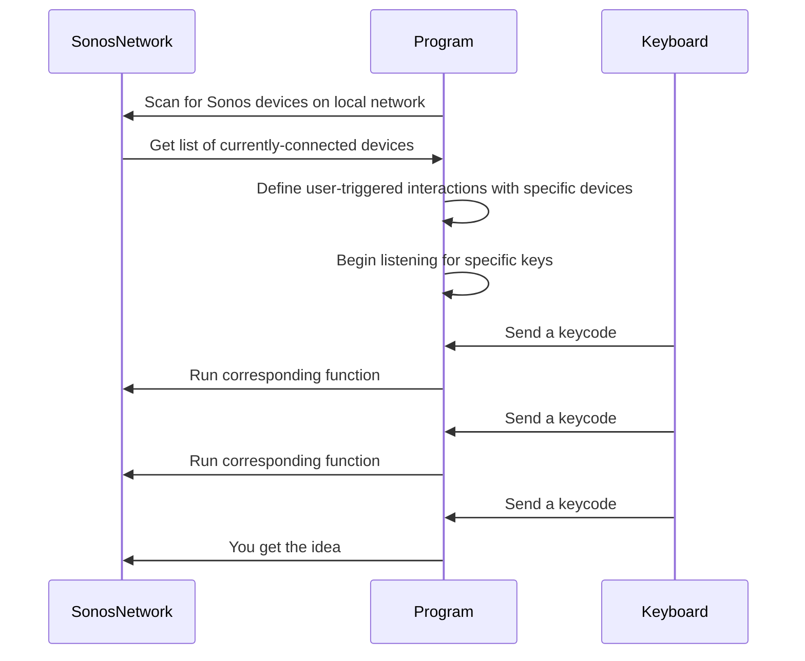

# Automating Sonos actions with node.js 

:::warning

**Caveat lector:** this page is about as finished as that freeway overpass in *Speed (1994)*

:::

:::info

"Line In" could mean a few different things in the context of my Sonos system: its the label for the `Connect:Amp` device in my home Sonos system, it can refer to the eponymous input jack[^1] in back of that device, and it can refer to the audio input channel that serves as the software interface to the signal going through that jack. To disambiguate, I'll use `Connect:Amp` to refer to the device and "line in", lowercase, to refer to the jack and/or its associated audio input channel—there is no meaningful distinction between the two within the software layer, and anywhere the distinction _is_ meaningful, it can be gleaned from context.

[^1]: Strictly speaking, it's a pair of stereo RCA jacks.

:::

## A view of the program from 10,000 feet
We have a preexisting Sonos system we want to act on; a keyboard as the physical UI for triggering actions; the `sonos` npm package providing a node.js API for defining and executing those actions; and a Raspberry Pi Zero W to orchestrate it all.




The software running on the Raspberry Pi contained most of the complexity and problems that needed to be solved; it also has some initialization steps missing from that high-level diagram of the running controller's behaviors. Here, then, is a more detailed view of what all needs to happen when that node.js script starts up:


### Aside: picking the right fights
This being a personal hobby project, I decided on a few specific tradeoffs upfront:
- manual testing > test code
  - unit tests et al. are great for validating code's behavior _within_ API boundaries[^2], but the correctness of this project's code depends almost entirely on its effects _across_ the boundary of Sonos' HTTP API; the cost/benefit of test code is wrong for this specific project.
  - the biggest benefit of test code is how its correctness guarantees, however flawed, can scale across multiple developers and long time frames; this project involved neither.
  - interactive affordances like REPLs should be aggressively sought out: by shortening the feedback loops of manual and exploratory testing, they act as multipliers on development speed, leverage, and confidence even where test code dare not go
- K.I.S.S.: minimize dependencies and tooling requirements
- javascript, not typescript
  - static types are wonderful tools for globally enforcing low-grade correctness across multiple developers and long time frames[^3], but, well, cf. above on testing
  - introducing a compilation step adds complexity, extra dependencies, and additional tooling requirements, and, well, cf. K.I.S.S. above
- code that is in any way Sonos-specific should prefer "good enough" and terse, ad hoc problem solving over theoretical portability; only bother spending time on clean, reusable abstractions for things that could be useful in wildly different projects, like "trigger arbitrary functions by typing keys" and "setup a REPL for connecting with the running program from another process, with access to its actual functions and values".

[^2]: This is even true of integration tests, which by definition test the software's behavior across some API boundary: in order to be useful and reliable, an integration test needs a controlled, repeatable setup and teardown of its test scenario, just like a unit test does. For this reason, integration tests are primarily helpful when they validate software's behavior across an _internal_ API boundary, still safely insulated from the slings and arrows of outrageous reality by the API boundary of the system as a whole.
[^3]: If this makes static typing just sound like a lower-effort way to run halfassed unit tests on every line of your codebase, good! That's essentially what their value add is.

These may not be the right choices for you, and they certainly aren't the same tradeoffs I would choose in a professional setting, but they were the right ones for this project. So, with that preamble out of the way, let's dig into how the code actually handles all those things that need to happen.

## Discover all Sonos devices on local network
Better get ready to `await`, because the devices being discovered are other IP addresses on the local wifi subnet, and network I/O is fundamentally async. I used the `sonos` package's `AsyncDeviceDiscovery` API. Here's a very simple example of how to use it:
```js
async function findDevices() {
  return await new AsyncDeviceDiscovery().discoverMultiple()
}
```

By default, this returns an array of device objects, arbitrarily-ordered, with asynchronous methods for querying their identity and metadata, sending command messages, etc. It's a reasonable, very use-case-agnostic implementation decision for the `sonos` package, but it's nowhere near optimal for my use case: I'm sending predefined commands to predefined devices, and I don't really want to deal with iterating over an anonymous list running async queries every time I want to find a specific device. Instead, with a little pre-processing, I can give myself something much nicer to work with. For most purposes I made an object `rooms`, with cleaned-up versions of the device names defined in Sonos as its keys and the corresponding device wrappers (with their pre-fetched metadata) its values, and (largely for debugging) I decided to keep another reference to the flat list of devices as `devices`, too. Device references were grouped into a destructuring-friendly return object:
```js
async function findDevices() {
  let devices = await new AsyncDeviceDiscovery().discoverMultiple()
  //
  devices = await Promise.all(
    devices.map(async (device) => {
      // this contains useful stuff like the device name and IP
      const deets = await device.deviceDescription()
      return {device, deets}
    })
  )
  // an object for looking up device objects by their camelcased room names
  const rooms = devices.reduce(
    (knownSpeakers, speaker) => ({
      ...knownSpeakers,
      [camelcase(speaker.deets.roomName)]: speaker,
    }), {})
  return { rooms, devices }
}
```

This is getting pretty close! I used _extremely_ similar code through several rounds of testing. However, networks are part of the real world, and the real world is flaky: sometimes a device randomly wouldn't be detected. If the dropped device is one the keyboard interacts with, we obviously have a problem, and if it's the line in we can't do squat; we also don't want device discovery to get caught in an infinite retry loop if one of the least-commonly-used speaker goes offline. I decided that the only device this gizmo truly can't do without is the `Connect:Amp`, so I centered the retry logic on that, renamed the function to reflect it, and moved onto more important issues. Here's what I ended up with:
```js
// extracted and closed over because no matter how many times I call `findLineInEtAl`,
// there's no benefit to initializing this object more than once
const snoop = new AsyncDeviceDiscovery()

async function findLineInEtAl({ maxTries } = { maxTries: Infinity }) {
  let rooms, devices
  let attempts = 0
  while (!rooms?.lineIn && attempts < maxTries) {
    attempts = attempts + 1
    process.stdout.write(rooms == null ? 'Finding rooms... ' : `Couldn't find "Line In" device, trying again... `)
    devices = await snoop.discoverMultiple()
    devices = await Promise.all(
      devices.map(async (device) => {
        const deets = await device.deviceDescription()
        return {device, deets}
      })
    )
    rooms = devices.reduce(
      (knownSpeakers, speaker) => ({
        ...knownSpeakers,
        [camelcase(speaker.deets.roomName)]: speaker,
      }), {})
    console.log('✅')
  }
  if (!rooms?.lineIn && attempts >= maxTries) {
    console.log(`shit man, i dunno, i can't find the line in box here`)
    process.exit()
  }
  return { rooms, devices }
}
```

With device object references in hand, or rather in scope, it was time to define some closures using them to execute user-triggered actions. First, though, a detour through the user input listener I wrote.


## Defining key listeners cleanly
Here were my goals for this slice of the system:
- process each individual character from the login shell's `STDIN` immediately after it is typed
- expose an ergonomic API/DSL for defining the keymap, a set of character->function mappings
- allow the keymap definition to be deferred until after device discovery is complete
- avoid unnecessary dependencies, sticking to the JS stdlib and node's built-in modules wherever possible
- build a "keymap" object[^4]

[^4]: While static types aren't much practical benefit to this project (see above), they _are_ fun, and can be a useful tool for thinking through and communicating the domain (and assumptions!) of the program's possible data. If I wanted to define types for these keymaps, I would use something like this:
    ```typescript
    // The generic Keymap type. Extending an exhaustive union of single-character string types
    // instead of `string` would be more precise; but it would also be a huge pain to write
    // and a hot, verbose mess in the type checker's error messages.
    type Keymap<Keycode> = Record<Key extends string & keyof Keycode, Function>

    // Refined for this program's use case:
    type PlaybackControlKeycode = "b" | "p" | "f"
    type RoomToggleKeycode = "t" | "l" | "k"
    type VolumeCommandKeycode = "u" | "d" | "m"
    type SonosKeycode = PlaybackControlKeycode | RoomToggleKeycode | VolumeCommandKeycode

    const myCoolKeymap: Keymap<SonosKeycode> = ...
    ```

## Adding a REPL right from the start: a decision that payed off over and over and over again
I cannot stress this enough: give yourself ways to poke at your system interactively! It's a fast way to find bugs and stress test your assumptions, right as you work, and it's vastly more reliable than keeping it all in your head and trying The Think System ™.

That seemed awfully tricky to do here at first, since the Raspberry Pi this script was running on was headless, with only 6 keys on its keyboard and no screen; I couldn't just drop right into a breakpoint in the main thread. What I wanted instead was to be able to ssh in and _then_ connect with a running REPL server which exposed the same exact functions and variables I was using to identify and interact with speakers. This was remarkably, impressively easy to do in node! The trick was connecting over a unix socket using `socat`. A wrapper script at `bin/repl` saved me from having to remember the exact incantation; here it is, for reference:
```sh
#!/usr/bin/env bash

if command -v rlwrap >& /dev/null; then
    rlwrap socat - UNIX-CONNECT:/tmp/noisebot-repl.sock
else
    socat - UNIX-CONNECT:/tmp/noisebot-repl.sock
fi

```
(There are nicer ways to deal with the socket filepath than hardcoding it, but there wasn't a compelling reason to spend the time doing so for this project.)

In any case, a way to connect is pointless with nothing to connect to; I still had to define the in-process REPL server I could connect to from a proper laptop over ssh.

```js
const repl = require('node:repl')
const net = require('node:net')

const openRepl = (extraContext, replSocketPath = '/tmp/noisebot-repl.sock') => {
  const replServer = net.createServer(socket => {
    const r = repl.start({
      input: socket,
      output: socket,
      terminal: true,
      useColors: true,
    })
    Object.assign(r.context, extraContext)
    r.on('exit', () => socket.end())
  })
  replServer.listen(replSocketPath)
  console.log(`To interact with this process via a node repl, run '<noisebot directory>/bin/repl' in another tty`)
  return replServer
}
```
The `openRepl` function returns the REPL server object in order that it can be properly cleaned up (with `replServer.close()`) when the script exits.

With this, you can start the REPL as soon as all the values you want to make accessible inside the REPL are defined. For this project, I passed myself references to all the discovered devices, along with functions for user-triggered commands and group management, but you can use this technique with any values you can dream up; there's nothing Sonos-specific about the REPL management code per se:
```js
const replServer = openRepl({
  rooms,
  ...rooms,
  isInGroup,
  forRoomsInGroup,
  toggleRoom,
  ensureLineInIsSource,
  ensureRoomHasOwnGroup,
})
```


## defining user-triggered actions
### A reminder which keys I was listening for and what each does
After writing and installing custom firmware, here's the keyboard layout I had:
<svg
  viewBox="0 0 260 120"
  width="100%"
  height="auto"
  xmlns="http://www.w3.org/2000/svg"
  style={{ maxWidth: '300px', margin: '2rem auto', display: 'block' }}
>
  {/* Keys - Top Row */}
  <rect x="10" y="10" width="50" height="40" rx="8" fill="#eee" stroke="#333" />
  <text x="35" y="35" fontSize="16" textAnchor="middle" fill="#333">b</text>

  <rect x="70" y="10" width="50" height="40" rx="8" fill="#eee" stroke="#333" />
  <text x="95" y="35" fontSize="16" textAnchor="middle" fill="#333">p</text>

  <rect x="130" y="10" width="50" height="40" rx="8" fill="#eee" stroke="#333" />
  <text x="155" y="35" fontSize="16" textAnchor="middle" fill="#333">f</text>

  {/* Keys - Bottom Row */}
  <rect x="10" y="70" width="50" height="40" rx="8" fill="#eee" stroke="#333" />
  <text x="35" y="95" fontSize="16" textAnchor="middle" fill="#333">l</text>

  <rect x="70" y="70" width="50" height="40" rx="8" fill="#eee" stroke="#333" />
  <text x="95" y="95" fontSize="16" textAnchor="middle" fill="#333">t</text>

  <rect x="130" y="70" width="50" height="40" rx="8" fill="#eee" stroke="#333" />
  <text x="155" y="95" fontSize="16" textAnchor="middle" fill="#333">k</text>

  {/* Rotary Knob */}
  <circle cx="220" cy="60" r="35" fill="#ccc" stroke="#333" strokeWidth="2" />
  <text x="220" y="48" fontSize="14" textAnchor="middle" fill="#000">↻ u</text>
  <text x="220" y="65" fontSize="14" textAnchor="middle" fill="#000">↺ d</text>
  <text x="220" y="81" fontSize="12" textAnchor="middle" fill="#222">(m)</text>
</svg>

Each keycode has a mnemonic meaning:
- top row: playback controls
  - left: `b`ackwards track
  - middle: ensure `p`honograph is audio source
  - right: `f`orwards track
- bottom: device toggles
  - `l`iving room speaker
  - `t`v soundbar
  - `k`itchen speaker
- knob: 
  - clockwise: `u`p volume
  - counterclockwise: `d`own volume
  - press: toggle `m`ute

The actual keycodes going between keyboard and script could have been anything, and as long as both sides "agreed" on their meaning it would have no impact on real users—but the mnemonics made it so much easier to do productive script development on a laptop keyboard before I had flashed custom keymappings to the keyboard firmware. Sticking to ordinary letters that were syntactically valid javascript property names without any need for escaping also made it very easy to write my key listeners in a friendly, readable DSL.

### `p`: ensure the audio source for the `Connect:Amp` device (and any other speakers in its group) is the line in.

### `l`, `t`, `k`: toggle a specific other device's membership in the `Connect:Amp`'s group
- `if` device is currently in the group
- `then`: it leaves the group
- `else`: it joins the group
for this I can use `sonos.joinGroup('Line In')` on other device objects to group with `Line In`
#### `b`, `f`: change tracks when streaming from software
#### `u`, `d`: volume up or down
#### `m`: toggle mute
