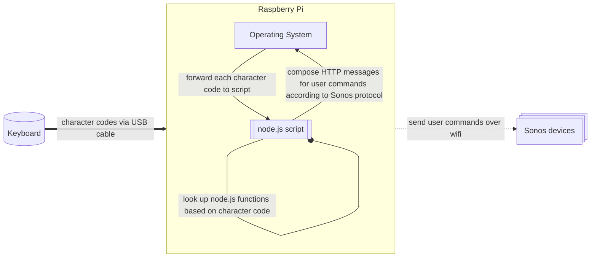
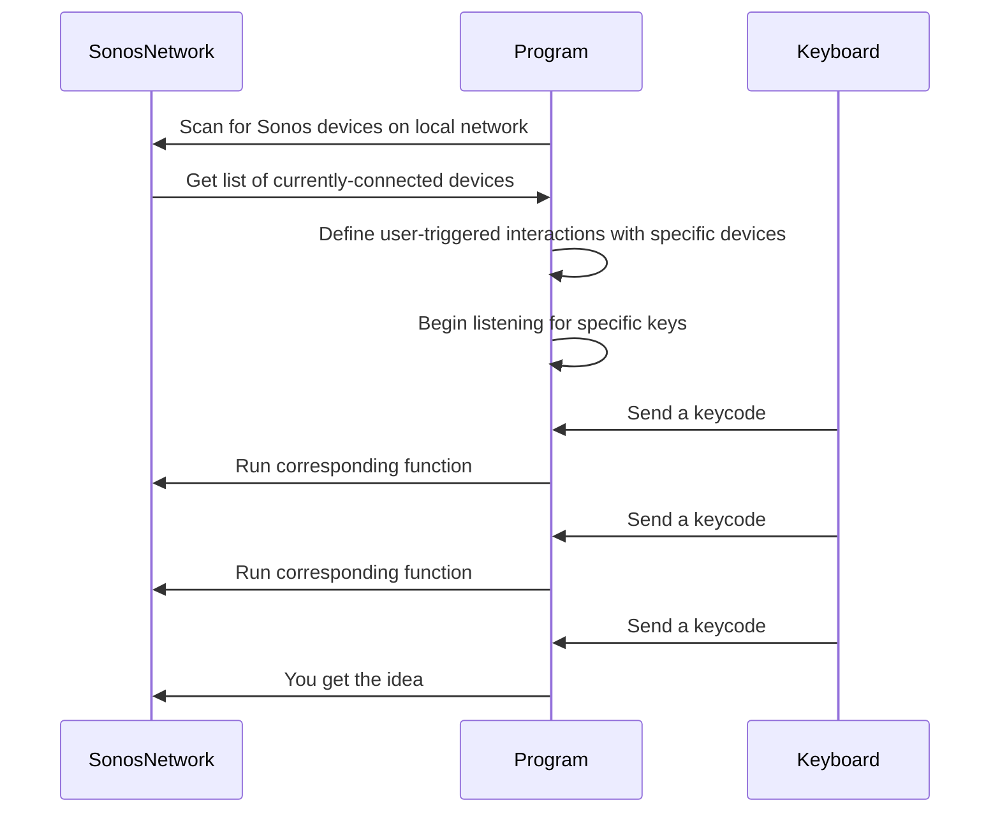

import Fin from "@site/src/components/fin"

# Automating Sonos actions with node.js 

:::info

"Line In" could mean a few different things in the context of my Sonos system: its the label for the `Connect:Amp` device in my home Sonos system, it can refer to the eponymous input jack[^1] in back of that device, and it can refer to the audio input channel that serves as the software interface to the signal going through that jack. To disambiguate, I'll use `Connect:Amp` to refer to the device and "line in", lowercase, to refer to the jack and/or its associated audio input channel—there is no meaningful distinction between the two within the software layer, and anywhere the distinction _is_ meaningful, it can be gleaned from context.

[^1]: Strictly speaking, it's a pair of stereo RCA jacks.

:::

## A view of the program from 10,000 feet
We have a preexisting Sonos system we want to act on; a keyboard as the physical UI for triggering actions; the `sonos` npm package providing a node.js API for defining and executing those actions; and a Raspberry Pi Zero W to orchestrate it all.


```mermaid
%%{ init: { 'flowchart': { 'curve': 'monotoneY' } } }%%
graph LR
  Rpi[Operating System]
  Script[[node.js script]]
  Keeb[(Keyboard)]
  Sonos@{ shape: processes, label: Sonos devices }
  Keeb== character codes via USB cable ==> computing
  computing-. send user commands over wifi .-> Sonos
  subgraph computing [Raspberry Pi]
    direction TB
    Rpi-- forward each character code to script --> Script
    Script-- "look up node.js functions based on character code" --o Script
    Script-- compose HTTP messages for user commands according to Sonos protocol --> Rpi
  end
```


The software running on the Raspberry Pi contained most of the complexity and problems that needed to be solved; it also has some initialization steps missing from that high-level diagram of the running controller's behaviors. Here, then, is a more detailed view of what all needs to happen when that node.js script starts up:


```mermaid
sequenceDiagram
    participant SonosNetwork
    participant Program
    participant Keyboard

    Program->>SonosNetwork: Scan for Sonos devices on local network
    SonosNetwork->>Program: Get list of currently-connected devices
    Program->>Program: Define user-triggered interactions with specific devices
    Program->>Program: Begin listening for specific keys
    Keyboard->>Program: Send a keycode
    Program->>SonosNetwork: Run corresponding function
    Keyboard->>Program: Send a keycode
    Program->>SonosNetwork: Run corresponding function
    Keyboard->>Program: Send a keycode
    Program->>SonosNetwork: You get the idea
```
### Aside: picking the right fights
This being a personal hobby project, I decided on a few specific tradeoffs upfront:
- manual testing > test code
  - unit tests et al. are great for validating code's behavior _within_ API boundaries[^2], but the correctness of this project's code depends almost entirely on its effects _across_ the boundary of Sonos' HTTP API; the cost/benefit of test code is wrong for this specific project.
  - the biggest benefit of test code is how its correctness guarantees, however flawed, can scale across multiple developers and long time frames; this project involved neither.
  - interactive affordances like REPLs should be aggressively sought out: by shortening the feedback loops of manual and exploratory testing, they act as multipliers on development speed, leverage, and confidence even where test code dare not go
- K.I.S.S.: minimize dependencies and tooling requirements
- javascript, not typescript
  - static types are wonderful tools for globally enforcing low-grade correctness across multiple developers and long time frames[^3], but, well, cf. above on testing
  - introducing a compilation step adds complexity, extra dependencies, and additional tooling requirements, and, well, cf. K.I.S.S. above
- code that is in any way Sonos-specific should prefer "good enough" and terse, ad hoc problem solving over theoretical portability; only bother spending time on clean, reusable abstractions for things that could be useful in wildly different projects, like "trigger arbitrary functions by typing individual keys" and "setup a REPL for connecting with the running program from another process, with access to its actual functions and values".

[^2]: This is even true of integration tests, which by definition test the software's behavior across some API boundary: in order to be useful and reliable, an integration test needs a controlled, repeatable setup and teardown of its test scenario, just like a unit test does. For this reason, integration tests are primarily helpful when they validate software's behavior across an _internal_ API boundary, still safely insulated from the slings and arrows of outrageous reality by the API boundary of the system as a whole.
[^3]: If this makes static typing just sound like a lower-effort way to run halfassed unit tests on every line of your codebase, good! That's essentially what their value add is.

These may not be the right choices for you, and they certainly aren't the same tradeoffs I would choose in a professional setting, but they were the right ones for this project. So, with that preamble out of the way, let's dig into how the code actually handles all those things that need to happen.

## Discover all Sonos devices on local network
Better get ready to `await`, because the devices being discovered are other IP addresses on the local wifi subnet, and network I/O is fundamentally async. I used the `sonos` package's `AsyncDeviceDiscovery` API. Here's a very simple example of how to use it:
```js
async function findDevices() {
  return await new AsyncDeviceDiscovery().discoverMultiple()
}
```

By default, this returns an array of device objects, arbitrarily-ordered, with asynchronous methods for querying their identity and metadata, sending command messages, etc. It's a reasonable, very use-case-agnostic implementation decision for the `sonos` package, but it's nowhere near optimal for my use case: I'm sending predefined commands to predefined devices, and I don't really want to deal with iterating over an anonymous list running async queries every time I want to find a specific device. Instead, with a little pre-processing, I can give myself something much nicer to work with. For most purposes I made an object `rooms`, with cleaned-up versions of the device names defined in Sonos as its keys and the corresponding device wrappers (with their pre-fetched metadata) its values, and (largely for debugging) I decided to keep another reference to the flat list of devices as `devices`, too. Device references were grouped into a destructuring-friendly return object:
```js
async function findDevices() {
  let devices = await new AsyncDeviceDiscovery().discoverMultiple()
  //
  devices = await Promise.all(
    devices.map(async (device) => {
      // this contains useful stuff like the device name and IP
      const deets = await device.deviceDescription()
      return {device, deets}
    })
  )
  // an object for looking up device objects by their camelcased room names
  const rooms = devices.reduce(
    (knownSpeakers, speaker) => ({
      ...knownSpeakers,
      [camelcase(speaker.deets.roomName)]: speaker,
    }), {})
  return { rooms, devices }
}
```

This is getting pretty close! I used _extremely_ similar code through several rounds of testing. However, networks are part of the real world, and the real world is flaky: sometimes a device randomly wouldn't be detected. If the dropped device is one the keyboard interacts with, we obviously have a problem, and if it's the line in we can't do squat; we also don't want device discovery to get caught in an infinite retry loop if one of the least-commonly-used speaker goes offline. I decided that the only device this gizmo truly can't do without is the `Connect:Amp`, so I centered the retry logic on that, renamed the function to reflect it, and moved onto more important issues. Here's what I ended up with:
```js
// extracted and closed over because no matter how many times I call `findLineInEtAl`,
// there's no benefit to initializing this object more than once
const snoop = new AsyncDeviceDiscovery()

async function findLineInEtAl({ maxTries } = { maxTries: Infinity }) {
  let rooms, devices
  let attempts = 0
  while (!rooms?.lineIn && attempts < maxTries) {
    attempts = attempts + 1
    process.stdout.write(rooms == null ? 'Finding rooms... ' : `Couldn't find "Line In" device, trying again... `)
    devices = await snoop.discoverMultiple()
    devices = await Promise.all(
      devices.map(async (device) => {
        const deets = await device.deviceDescription()
        return {device, deets}
      })
    )
    rooms = devices.reduce(
      (knownSpeakers, speaker) => ({
        ...knownSpeakers,
        [camelcase(speaker.deets.roomName)]: speaker,
      }), {})
    console.log('✅')
  }
  if (!rooms?.lineIn && attempts >= maxTries) {
    console.log(`shit man, i dunno, i can't find the line in box here`)
    process.exit()
  }
  return { rooms, devices }
}
```

With device object references in hand, or rather in scope, it was time to define some closures using them to execute user-triggered actions. First, though, a detour through the user input listener I wrote.


## On debugging and feedback loops: adding a REPL right from the start was a decision that payed off over and over again
Give yourself ways to poke at your system interactively! It's a fast way to find bugs and stress test your assumptions, right as you work, and it's vastly more reliable than keeping it all in your head and trying The Think System ™.

That seemed awfully tricky to do here at first, since the Raspberry Pi this script was running on was headless, with only 6 keys on its keyboard and no screen; I couldn't just drop right into a breakpoint in the main thread. What I wanted instead was to be able to ssh in and _then_ connect with a running REPL server which exposed the same exact functions and variables I was using to identify and interact with speakers. This was remarkably, impressively easy to do in node! The trick was connecting over a unix socket using `socat`. A wrapper script at `bin/repl` saved me from having to remember the exact incantation; here it is, for reference:
```sh
#!/usr/bin/env bash

if command -v rlwrap >& /dev/null; then
    rlwrap socat - UNIX-CONNECT:/tmp/noisebot-repl.sock
else
    socat - UNIX-CONNECT:/tmp/noisebot-repl.sock
fi

```
(There are nicer ways to deal with the socket filepath than hardcoding it, but there wasn't a compelling reason to spend the time doing so for this project.)

In any case, a way to connect is pointless with nothing to connect to; I still had to define the in-process REPL server I could connect to from a proper laptop over ssh.

```js
const repl = require('node:repl')
const net = require('node:net')

const openRepl = (extraContext, replSocketPath = '/tmp/noisebot-repl.sock') => {
  const replServer = net.createServer(socket => {
    const r = repl.start({
      input: socket,
      output: socket,
      terminal: true,
      useColors: true,
    })
    Object.assign(r.context, extraContext)
    r.on('exit', () => socket.end())
  })
  replServer.listen(replSocketPath)
  console.log(`To interact with this process via a node repl, run '<noisebot directory>/bin/repl' in another tty`)
  return replServer
}
```
The `openRepl` function returns the REPL server object in order that it can be properly cleaned up (with `replServer.close()`) when the script exits.

With this, you can start the REPL as soon as all the values you want to make accessible inside the REPL are defined. For this project, I passed myself references to all the discovered devices, along with functions for user-triggered commands and group management, but you can use this technique with any values you can dream up; there's nothing Sonos-specific about the REPL management code per se:
```js
const replServer = openRepl({
  rooms,
  ...rooms,
  isInGroup,
  forRoomsInGroup,
  toggleRoom,
  ensureLineInIsSource,
  ensureRoomHasOwnGroup,
})
```


## Defining key listeners cleanly
Allow me to quote myself:
> code that is in any way Sonos-specific should prefer "good enough" and terse, ad hoc problem solving over theoretical portability; only bother spending time on clean, reusable abstractions for things that could be useful in wildly different projects, like "trigger arbitrary functions by typing individual keys"

_Well well well_.

This intersects with some idiosyncratic interests I hold as a programmer in ways that are probably worth pointing out up front: I'm a big fan of interactive TUIs; the sort of workflow efficiencies gained by using painfully clear names for less-common operations but single-letter shortcuts for the ubiquitous ones; and keyboard-driven interfaces in general. I was specifically inspired by emacs' keyboard-driven [transient](https://jd.codes/posts/transient-emacs/) menus, which let you build commands—and often, complex variations of those commands—with just a few easily-discoverable keystrokes.

Here were my goals for this slice of the system:
- process each individual character from the login shell's `STDIN` immediately after it is typed
- reinventing small wheels is preferable to unnecessary dependencies; in this case, all I needed was node's built-in `readline/promises` and the `process.stdin`/`process.stdout` streams.
- expose an ergonomic API for defining the keybindings by providing a "keymap" object[^4]: a simple "bag of methods" object with character->function fields
- write that API with enough flexibility to play well with contexts outside of this project's main use case, whether that be a dynamically-opened REPL, a random future node CLI, or whatever
- provide a `listenForKeys(keybindings)` function so that defining the keymap can be deferred until after async device discovery is complete

[^4]: While static types aren't much practical benefit to this project (see above), they _are_ fun, and can be a useful tool for thinking through and communicating the domain (and assumptions!) of the program's possible data. If I wanted to define types for these keymaps, I would use something like this:
    ```typescript
    // The generic Keymap type. Extending an exhaustive union of single-character string types
    // instead of `string` would be more precise; but it would also be a huge pain to write
    // and a hot, verbose mess in the type checker's error messages.
    type Keymap<Keycode> = Record<Key extends string & keyof Keycode, Function>

    // Refined for this program's use case:
    type PlaybackControlKeycode = "b" | "p" | "f"
    type RoomToggleKeycode = "t" | "l" | "k"
    type VolumeCommandKeycode = "u" | "d" | "m"

    const myCoolKeymap: Keymap<PlaybackControlKeycode & RoomToggleKeycode & VolumeCommandKeycode> = ...
    ```
    
Let's start with a few small `listenForKeys` examples before showing its code. First, to demonstrate the simple case, a little program for printing emoticons on the command line:
```js
listenForKeys({
  // "shrug"
  s() {
    console.log('¯\_(ツ)_/¯')
  },
  // "flip"
  f() {
    console.log('(╯°□°）╯︵ ┻━┻')
  },
  // "hey-o"
  h() {
    console.log('(╭☞ω)╭☞')
  },
  // "muscles"
  m() {
    console.log('ᕙ(⇀‸↼‶)ᕗ')
  },
})
```

While debugging the controller's work-in-progress code with a socket-based, out-of-process connections to a REPL server, I realized that there were cases where I needed additional, unrelated cleanup logic to run at the same time I closed the key listener's input stream; to support that, you can use a `closeInput => keymap` function as your argument instead. Here's a simplified example of that custom cleanup:
```js
listenforKeys(closeInput => {
  let replServer
  const openNewRepl = () => {
    replServer = openRepl({...customReplContext})
  }

  return {
    o: openNewRepl,
    q() {
      closeInput()
      replServer?.close()
      process.exit()
    },
  }
})
```

So. Now that you have a sense of what it's doing, here's the implementation, which is simple enough to paste in full:
```js
const readline = require('readline/promises')

// returns a readline interface, an open stream which will keep the process alive until it
// is closed. There are a few ways to do that:
// - by explicitly closing the returned stream `rl` (`rl.close()`)
// - by providing an object arg whose keys do not conflict with the default binding, "q" open
// - by providing a function arg, which will be called with an
//   `rl`-closing closure arg so you can make your own keymap binding to close it
const listenForKeys = (keybindings) => {
  const { stdin: input, stdout: output } = process
  const rl = readline.createInterface({input, output})
  const closer = rl.close.bind(rl)

  const defaults = {
    q() {
      console.log('byeeeeeeee')
      closer()
    },
  }
  let keymap
  if (typeof keybindings === 'function') {
    keymap = keybindings(closer)
  } else {
    keymap = {...defaults, ...keybindings}
  }

  const onKeypress = (key, data) => {
    const keybind = keymap[key] || keymap[key.toLowerCase()]

    // add a newline so any logging output from the keymap function is displayed on a
    // different line than the user-entered character
    console.log("")

    if (typeof keybind === 'function') keybind.bind(keymap)()
  }

  // allow toggling the key listener inside the keymap however it's defined (for doing
  // fancypants stuff like opening a custom repl)
  const _stopListening = () => rl.input.off('keypress', onKeypress)
  const _startListening = () => rl.input.on('keypress', onKeypress)

  Object.assign(keymap, { _stopListening, _startListening })

  // kick things off
  _startListening()

  return { rl, onKeypress, keymap }
}
```

## Defining user-triggered actions
### `l`, `t`, `k`: toggle a specific other device's membership in the `Connect:Amp`'s group
[start with the top level and work down]
```js
```
### `u`, `d`, and `m`: volume control
```js
  const volumeControls = {
    _volumeIncrement: 4,
    async m() {
      const lineInGroup = await ensureRoomHasOwnGroup(lineIn)
      // This currently toggles mute status independently for each speaker in the group
      // instead of managing the group as a whole.
      // TODO if any speaker in group is unmuted, mute all; else unmute all
      forRoomsInGroup(lineInGroup, async (room) => {
        const { device } = room
        await device.setMuted(!await device.getMuted())
      })
    },
    async d() {
      const lineInGroup = await ensureRoomHasOwnGroup(lineIn)
      forRoomsInGroup(lineInGroup, async (room) => {
        const { device, deets } = room
        const newVolume = await device.getVolume() - this._volumeIncrement
        console.log(`lowering ${deets.roomName} volume to ${newVolume}`)
        await device.setVolume(newVolume)
      })
    },
    async u() {
      const lineInGroup = await ensureRoomHasOwnGroup(lineIn)
      forRoomsInGroup(lineInGroup, async (room) => {
        const { device, deets } = room
        const newVolume = await device.getVolume() + this._volumeIncrement
        console.log(`raising ${deets.roomName} volume to ${newVolume}`)
        await device.setVolume(newVolume)
      })
    },
  }
```
### `p`, `b`, `f`[^6]: digital playback controls
Navigating `b`ackwards and `f`orwards in track-based digital streams is a first-class feature in the `sonos` package's device object API and a second-class feature for a device centered on streaming phonograph audio; I'll let those one-liners speak for themselves.
```js
  const playbackControls = {
    async p() {
      await ensureLineInIsSource().catch(wtf)
    },
    async b() {
      await lineIn.device.previous().catch(wtf)
    },
    async f() {
      await lineIn.device.next().catch(wtf)
    },
  }
```
`p` didn't need to be its own key, really: it's already called whenever a speaker toggle is pressed, which covers the obvious use case (the needle went down and no sound played anywhere) and enables a hacky workaround for other scenarios (toggle a connected speaker off and back on). But its existence as a dedicated button makes sense too, and provides a little more flexibility; and anyway, having erred on the side of extra buttons when ordering my macropad, I had the real estate to spare. 

There's no higher-level wrapper function for selecting the line in as input source in the library code[^5], so I had to manually build a URI that is, shall we say, not optimized for human-readability:
```js
  const ensureLineInIsSource = async () => {
    const macCleaned = (await lineIn.device.getZoneInfo()).MACAddress.replace(/:/g, '')

    await lineIn.device.setAVTransportURI(
      `x-rincon-stream:RINCON_${macCleaned}01400`
    )
  }
```

"Make this function work properly" spent an embarassingly long time in the "TODO" list due to a typo in the static portion of the URI. Some days the bear eats you.

[^5]: There was, and thank goodness, [a file called `examples/switchToLineIn.js`](https://github.com/bencevans/node-sonos/blob/abb0c01d49c089bf47c06da9dce8fa9bbd846719/examples/switchToLineIn.js) for reference, though

[^6]: Despite being such a giant softie that cringe comedy causes me actual pain, my sense of humor harbors a deep dark streak; enough so that I cannot see "`p`, `b`, `f`" and _not_ drop a link to [Perry Bible Fellowship webcomic](https://pbfcomics.com/). If you're not already familiar and Franz Kafka's writing makes you laugh harder than you cry, do yourself a favor and click through.

## Wrapping up
That's about it! If you want to dig into _even more_ of the gory details, or adapt the code to your own Sonos-controlling widget needs, check out the repository on github at [`ambirdsall/noisebot`](https://github.com/ambirdsall/noisebot). Otherwise, thanks for reading; I hope you found something in here interesting, useful, or both.

<Fin />
