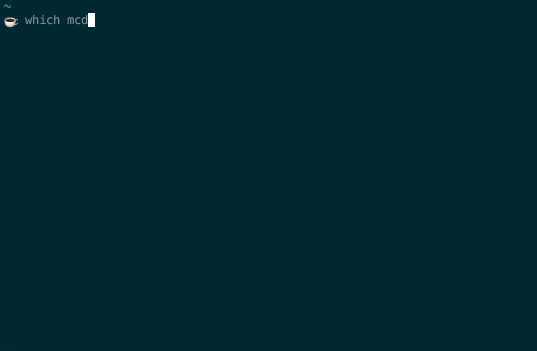

## Backticks Are Fantastic
I mean, [legit
awesome](http://www.refining-linux.org/archives/44/ZSH-Gem-10-Backtick-expansion/).
Here's a contrived recreation of a real-world example I encountered:

Let's break this down. When making a symbolic link, you have to type out the absolute path to the
link target. There are reasons for that (though I'd prefer `ln` just expanded relative links before
making the symlink, tbh), but a lot of directory names are a hassle to type out. Everyone who's
worked in a JVM language feels me.

Two things help:
1. If, as is often the case, you want to link to go in your current directory, you can totally omit the second argument
1. Typing some shell expression inside backticks which generates the path. If you use `bash`, you just have to trust your short-term memory, but hitting `tab` expands that expression interactively in `zsh`. You use `zsh`, right?

Some would argue that the `$()` subshell operator has strictly more powerful semantics than
backticks because it can be nested; they are, of course, correct. Other people like subshells
because when you nest them, it reads just like lisp code; they are, of course, nerds[^1]. When you don't
have to nest anything, though, backticks have a killer advantage over subshells:

1. 33% fewer keystrokes

Choose your own adventure.

[^1]: When it comes to lisp, I am, of course, [a gigantic
    nerd](https://github.com/ambirdsall/moon-phase) myself.
